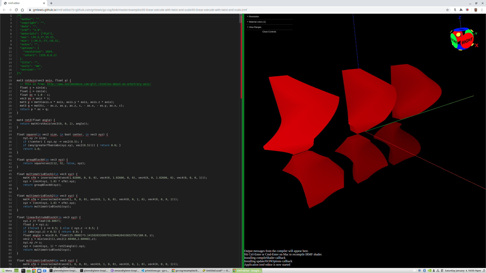

# Linear Extrude with Twist and Scale

05-linear-extrude-with-twist-and-scale is an example taken from the OpenSCAD User Manual:
https://en.wikibooks.org/wiki/OpenSCAD_User_Manual/Commented_Example_Projects

- Try loading [05-linear-extrude-with-twist-and-scale.irmf](https://gmlewis.github.io/irmf-editor/?s=github.com/gmlewis/go-csg/blob/master/examples/05-linear-extrude-with-twist-and-scale/05-linear-extrude-with-twist-and-scale.irmf) now in the experimental IRMF editor!

---

# License

Copyright 2019 Glenn M. Lewis. All Rights Reserved.

Licensed under the Apache License, Version 2.0 (the "License");
you may not use this file except in compliance with the License.
You may obtain a copy of the License at

    http://www.apache.org/licenses/LICENSE-2.0

Unless required by applicable law or agreed to in writing, software
distributed under the License is distributed on an "AS IS" BASIS,
WITHOUT WARRANTIES OR CONDITIONS OF ANY KIND, either express or implied.
See the License for the specific language governing permissions and
limitations under the License.
